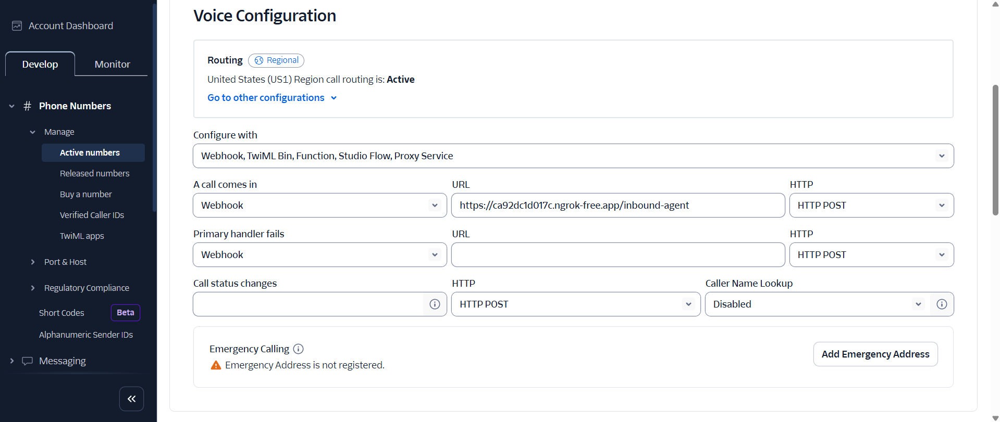
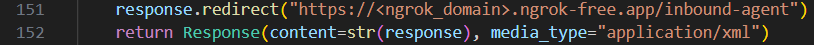
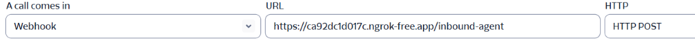

# Voice Call Agent

An **AI-powered voice call agent** that helps users determine the most suitable visa type through interactive phone conversations. Built with **FastAPI**, **Twilio**, **Ngrok**, and **Groq LLM**.

- **Inbound call handling** via Twilio Voice API
- **Speech recognition** using Twilio's Gather functionality
- **Conversational AI** powered by Groq's LLM (llama-3.1-8b-instant)
- **Per-call conversation history** for contextual responses
- **Intelligent visa recommendations** based on user responses
- **Automatic call termination** when user said "Thank you", or "Thanks" anytime in the call (implemented for usecase specific).
- **Real-time voice interaction** with TTS and STT

## Prerequisites

- Python 3.9+
- [Twilio Account](https://www.twilio.com/) with phone number
- [Groq API Key](https://groq.com/)
- [Ngrok](https://ngrok.com/) for local development

## How To Run

### 1. Create Virtual Environment
```bash
python -m venv venv

# Activate virtual environment
# On Windows:
venv/Scripts/activate
# On macOS/Linux:
source venv/bin/activate
```

### 2. Install Dependencies
```bash
pip install -r requirements.txt
```

### 3. Environment Configuration
Create a `.env` file in the project root:

```env
TWILIO_ACCOUNT_SID=your_twilio_account_sid
TWILIO_AUTH_TOKEN=your_twilio_auth_token
TWILIO_PHONE_NUMBER=your_twilio_phone_number
GROQ_API_KEY=your_groq_api_key [Testing purpose]
```

## Quick Start

### 1. Start the FastAPI Server
```bash
python voice_agent.py
```

The API will be available at `http://localhost:8080`

### 2. Expose Local Server with Ngrok
```bash
ngrok http 8080
```

Note the forwarding URL (e.g., `https://abc123.ngrok-free.app`)

### 3. Configure Twilio Webhook

1. Go to your [Twilio Console](https://console.twilio.com/)
2. Navigate to **Phone Numbers → Manage → Active Numbers**
3. Select your phone number
4. Under **Configure Tab** **Voice Configuration → A Call Comes In**:
   - Set webhook URL: `https://ngrok-domain.ngrok-free.app/inbound-agent`
   - Method: `HTTP POST`

- 

### 4. Change the domain name at codebase
 - `https://<ngrok_domain>.ngrok-free.app/inbound-agent`
   - Find the ngrok url and replace <ngrok_domain>.

## How It Works

### Call Flow
1. **Incoming Call**: User dials your Twilio number
2. **Initial Greeting**: AI agent welcomes the caller
3. **Information Gathering**: Agent asks 3-4 key questions:
   - Current nationality/citizenship
   - Destination country
   - Purpose of travel/stay
   - Duration of intended stay
4. **AI Processing**: Groq LLM analyzes responses and determines suitable visa types
5. **Recommendation**: Agent provides personalized visa recommendations
6. **Call Completion**: Conversation ends when user expresses satisfaction

### Example Conversation
```
AI: "Hello! I'm your AI visa assistant. I'll help you find the right visa type. 
     What's your current nationality?"

User: "I'm from India."

AI: "Great! Which country are you planning to visit or move to?"

User: "United States for work."

AI: "What type of work will you be doing?"

User: "Software engineering at a tech company."

AI: "Based on your responses, I recommend looking into the H-1B visa for 
     specialty workers. This visa is designed for..."
```

## Architecture

```
Caller│───▶│Twilio│───▶│FastAPI│───▶│Groq LLM API
```

## Configuration

### Environment Variables

| Variable | Description | Required |
|----------|-------------|----------|
| `TWILIO_ACCOUNT_SID` | Twilio Account SID | ✅ |
| `TWILIO_AUTH_TOKEN` | Twilio Auth Token | ✅ |
| `TWILIO_PHONE_NUMBER` | Twilio Phone Number | ✅ |
| `GROQ_API_KEY` | Groq API Key | ✅ |


### API Endpoints
- `POST /inbound-agent`: Main webhook endpoint for Twilio

## Troubleshooting

### Common Issues

**Ngrok URL Changes**
- Ngrok URLs change on restart
- Update Twilio webhook URL when restarting ngrok
   - Codebase
      - 
      - 
   - Twilio website
      - 

**Audio Issues**
- Ensure proper microphone permissions
- Check Twilio account balance
- Verify phone number configuration

**API Errors**
- Check Groq API key validity
- Verify Twilio credentials
- Monitor rate limits

## 🔗 Resources

- [Twilio Voice API Documentation](https://www.twilio.com/docs/voice)
- [FastAPI Documentation](https://fastapi.tiangolo.com/)
- [Groq API Documentation](https://console.groq.com/docs/overview)
- [Groq API](https://console.groq.com/keys)
- [Ngrok Documentation](https://ngrok.com/docs)

## Quick Commands

```bash
# Start development server
uvicorn voice_agent:app --reload

# Expose local server
ngrok http 8080

# Install dependencies
pip install -r requirements.txt

# Run with environment variables
python voice_agent.py
```

---
